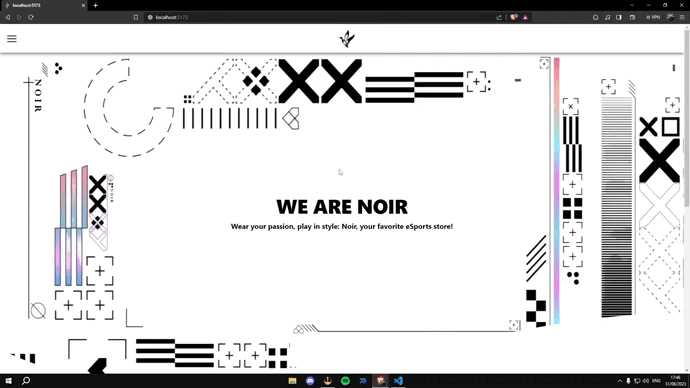

# Proyecto de React
## Tomas Bianco
### Comision 47120
### Noir Store

#### De que se trata NoirStore?
Noir Store es un proyecto de estudio de React JS en CoderHouse, se trata de un ecommerce enfocado en la venta de ropa, con items filtrados por categoria.

#### Preview: 

### Objetivos.

* Deberás desarrollar la navegabilidad básica de la aplicación, demostrando que la app permite ver el catálogo, y navegar a un detalle.

### Consignas a entregar:
##### Rutas a configurar
* ‘/’ navega a 'ItemListContainer' ✔
* ‘/category/:id’  'ItemListContainer' ✔
* ‘/item/:id’ navega a 'ItemDetailContainer' ✔
##### Links a configurar
* Clickear en el brand debe navegar a ‘/’ ✔
* Clickear un Item.js debe navegar a /item/:id ✔
* Clickear en una categoría del navbar debe navegar a /category/:categoryId ✔

[Linkedin](https://www.linkedin.com/in/facundo-bianco-2625ab248/)